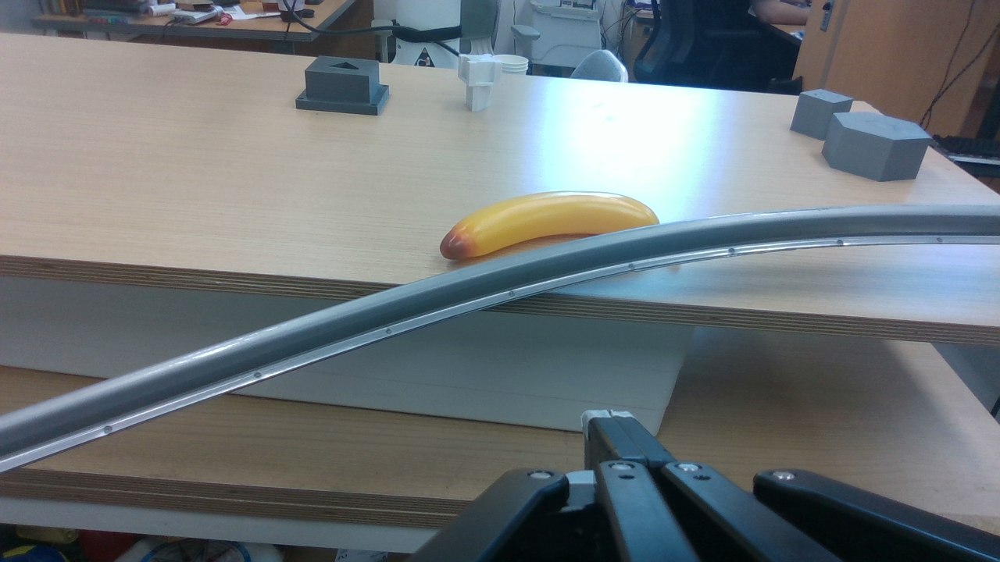

1. Check if **Eigen3** is installed
```
ls /usr/include/eigen3/Eigen
dpkg -l | grep libeigen3-dev

```

2. **GLEW** build
```
$ sudo apt-get update
$ sudo apt-get install build-essential libxmu-dev libxi-dev libgl-dev cmake git
$ sudo apt-get install build-essential libxmu-dev libxi-dev libgl-dev libglu-dev


$ cd /usr/local
$ git clone https://github.com/nigels-com/glew.git

$ cd glew
$ make extensions
$ make
$ sudo apt install glew-utils

<!-- $ cd build
$ cmake ./cmake
$ make -j4 -->

$ vi ~/.bashrc
## export LD_LIBRARY_PATH=/usr/local/glew/build/lib:$LD_LIBRARY_PATH
$ source ~/.bashrc

```

3. **GLFW3**
```
sudo apt-get update
sudo apt-get install libglfw3 libglfw3-dev
## check if GLFW3 is installed
dpkg -l | grep libglfw3
```

4. **OpenCV4**
```
pkg-config --modversion opencv4
dpkg -l | grep libopencv
```
- Test with https://github.com/gist-ailab/3DObjectTracking/blob/master/ICG/readme_hs.md#test-opencv


5. **K4A**
```
sudo apt-get update
sudo apt-get install git cmake build-essential
sudo apt-get install libudev-dev
sudo apt-get install libsoundio-dev

cd /usr/local
sudo git clone https://github.com/microsoft/Azure-Kinect-Sensor-SDK.git
cd Azure-Kinect-Sensor-SDK

sudo mkdir build && cd build
sudo cmake ..
sudo make
sudo make install

sudo ldconfig
echo "/usr/local/lib" | sudo tee /etc/ld.so.conf.d/k4a.conf
sudo ldconfig

k4aviewer
```
<!-- 
2. install K4A
```
$ curl -sSL https://packages.microsoft.com/keys/microsoft.asc | sudo apt-key add -
$ sudo apt-add-repository https://packages.microsoft.com/ubuntu/18.04/prod
$ curl -sSL https://packages.microsoft.com/config/ubuntu/18.04/prod.list | sudo tee /etc/apt/sources.list.d/microsoft-prod.list
$ curl -sSL https://packages.microsoft.com/keys/microsoft.asc | sudo apt-key add -
$ sudo apt-get update
$ sudo apt install libk4a1.3-dev            (=1.3.0)
$ sudo apt install libk4abt1.0-dev          (=1.0.0)
$ sudo apt install k4a-tools=1.3.0
k4aviewer   ## to test,
``` -->

6. **realsense2**
```
sudo apt-get update
sudo apt-get install git libssl-dev libusb-1.0-0-dev libudev-dev pkg-config libgtk-3-dev libglfw3-dev

cd /usr/local
sudo git clone https://github.com/IntelRealSense/librealsense.git
cd librealsense

## build and install
sudo mkdir build && cd build
sudo cmake ..
sudo make
sudo make install

## update udev rules
sudo cp ../config/99-realsense-libusb.rules /etc/udev/rules.d/
sudo udevadm control --reload-rules && udevadm trigger

## check if installed well
pkg-config --modversion realsense2

## check if realsense is connected
lsusb
# result : 
# Bus 002 Device 002: ID 8086:0b3a Intel Corp. Intel(R) RealSense(TM) Depth Camera 435i
## run realsense_test.cpp
g++ realsense_test.cpp -o realsense_test -lrealsense2
./realsense_test

## run realsense_test2.cpp
sudo apt-get update
sudo apt-get install libopencv-dev

g++ realsense_test2.cpp -o realsense_test2 -I/usr/include/opencv4 -lrealsense2 -lopencv_core -lopencv_imgcodecs -lopencv_highgui -lopencv_imgproc
./realsense_test2
```



3. build Doxygen
```
<!-- # download Doxygen from 
tar -xvzf ~
mkdir build && cd build
### Error
    sudo apt update
    sudo apt-get install flex
    sudo apt-get install bison
cmake -G "Unix Makefiles" ..
make -->
sudo apt-get install doxygen
```

## dataset setting
--data
    --ycbv
        --image_sets/keyframe.txt

```
ln -s "/media/hee/Extreme Pro/dataset/YCB-Video/HUGGING_FACE/YCB-Video-Base/image_sets"


```


## build
```
cd build/
cmake -DUSE_AZURE_KINECT=OFF -DUSE_REALSENSE=OFF ../
/home/hee/.local/bin/cmake --build /home/hee/workspace/src/3DObjectTracking/ICG/build --config Debug --target all
make
```

## Execute
```
cd build/
./examples/evaluate_ycb_dataset
```

<!-- 
---------------------------------------------------------------------
## RBOT dataset
```
cd data
ln -s "/media/hee/MGTEC/dataset/RBOT_dataset"
# set directory at evaluate_rbot_dataset.cpp
```

## build
```
cd build/
cmake -DUSE_AZURE_KINECT=OFF -DUSE_REALSENSE=OFF ../
make
```

## Execute
```
cd build/
./examples/evaluate_rbot_dataset
``` -->


## Test opencv 
- make example_opencv.cpp file
```
g++ -o example_opencv example_opencv.cpp `pkg-config --cflags --libs opencv4`
./example_opencv
```

ExecuteMeasuredTrackingCycle